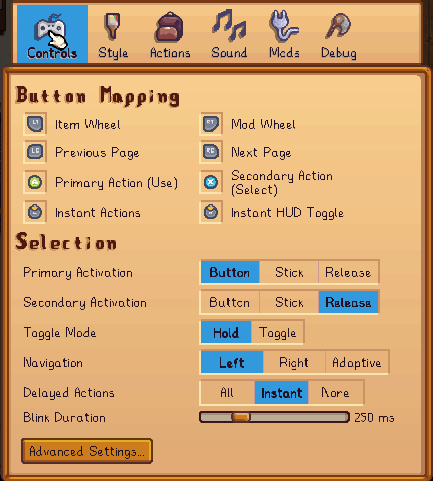
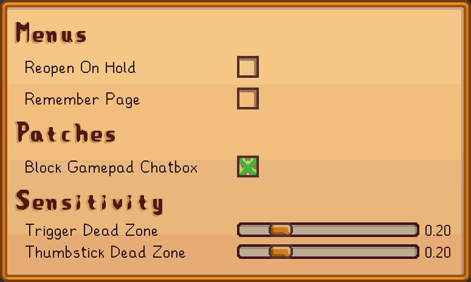
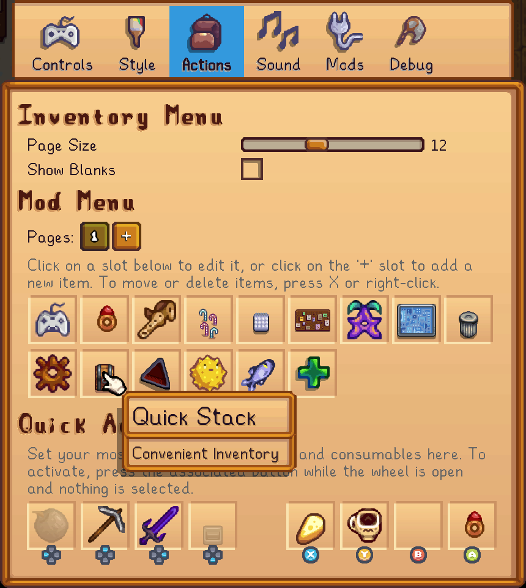
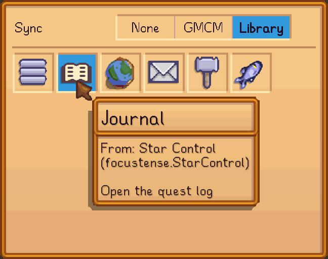
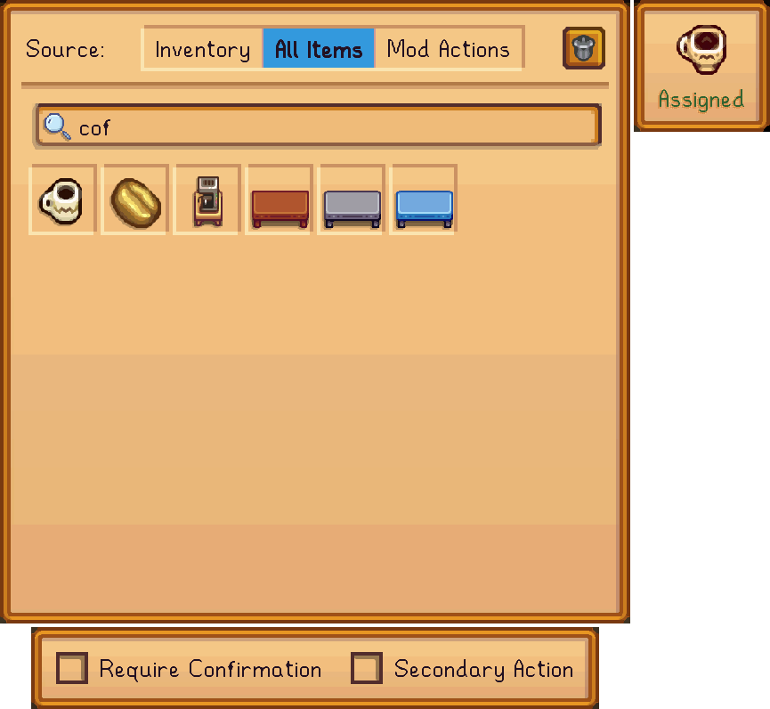
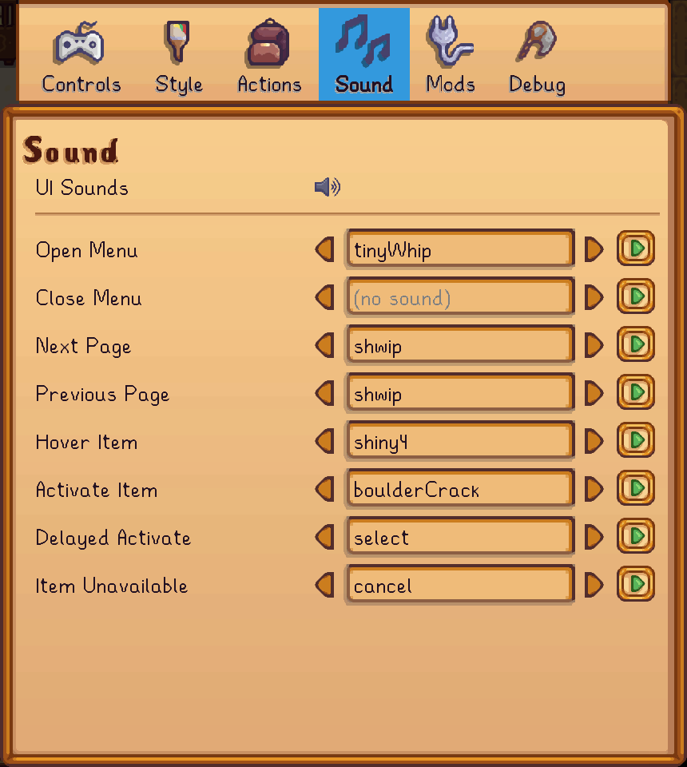
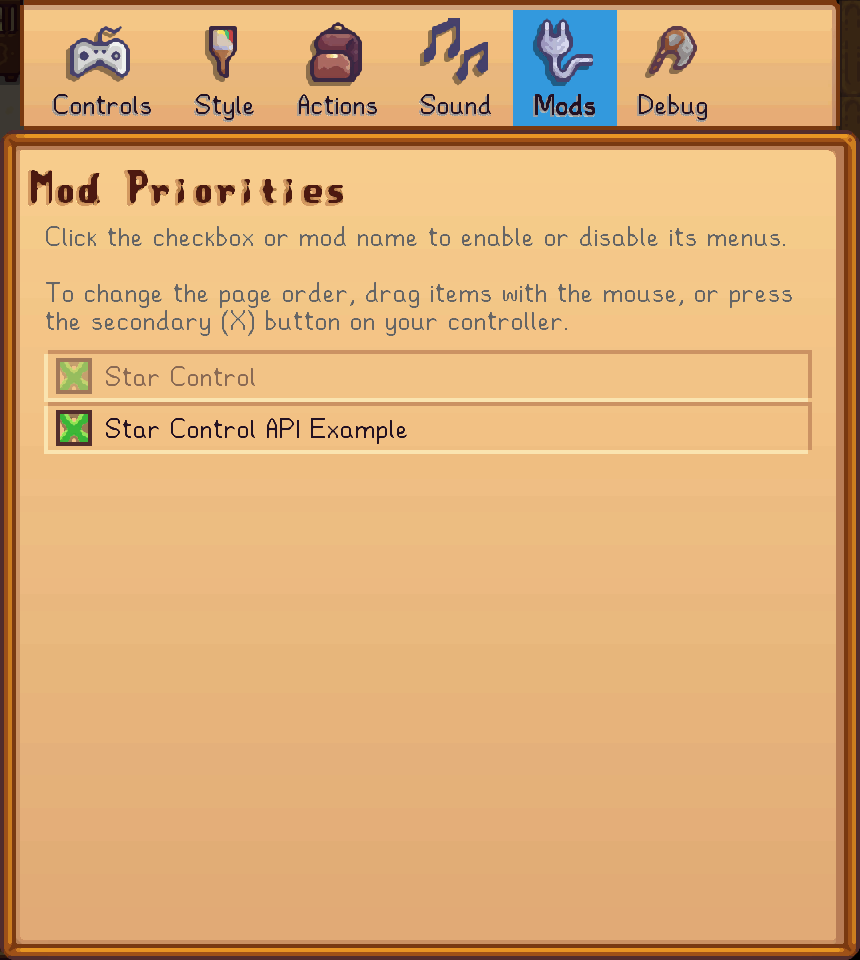
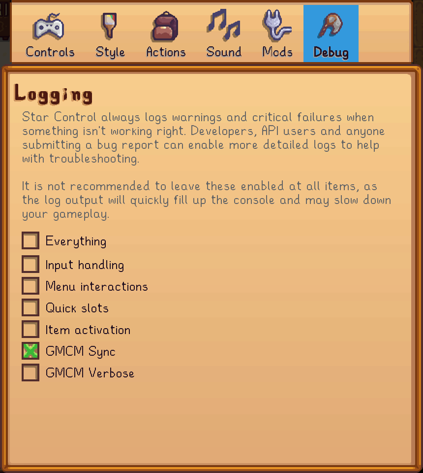

# Configuration

Nearly every aspect of Star Control is configurable, from the button bindings to the visual style to the menu items and more. If you aren't happy with the default settings—for example, if you have strong attachments to the game's inventory/tool-management system and want to keep that part just like vanilla—you can do this in the mod settings.

Settings can be accessed two ways:

1. Using [Generic Mod Config Menu](https://www.nexusmods.com/stardewvalley/mods/5098), or
2. Using the [Mod Actions Pie Menu](controller-hud.md#pie-menus), and [activating](controller-hud.md#activation) the {.inline-icon} **Star Control Settings** item which is usually at the top.

## Controls

The first page of the mod settings is all about how you interact with the [menus and other overlay features](controller-hud.md).

By default, Star Control's settings are to:

- Use :prompts-left-trigger:{.medium} and :prompts-right-trigger:{.medium} to open the menus
- Keep the menus open while the trigger is held, and release them when the trigger is released
- Accept :prompts-a:{.medium} for the primary action and :prompts-x:{.medium} for the secondary action
- Always use the left stick to navigate a pie menu
- Delay "instant" actions, mainly tool selection, during which the item will briefly flash before the menu closes.

!!! note

    The image above shows :prompts-right-stick: assigned to the "Instant HUD Toggle", but by default this button is unassigned, because it conflicts with the game's chatbox. If you don't use the chatbox, and want to use :prompts-right-stick: for the HUD toggle or for any other Star Control feature, be sure to check the [advanced settings](#advanced-controls) for how to prevent conflicts.

Everything about this can be changed:

- Any button can be reassigned by moving the cursor over it and pressing :prompts-a:{.medium} to choose a new button, or by pressing :prompts-x:{.medium} to **remove** the assigned button (e.g. if you don't want to use the Item Wheel/Inventory Menu at all, or don't care about pagination, etc.).
- Thumbstick press or trigger release can be assigned as an alternative, _additional_ way of activating a focused item. Combined with the above, you can make it the _only_ way of activating a focused item by unassigning the `Primary Action` and/or `Secondary Action` buttons.
- Toggle Mode keeps the menu open until the trigger button is pressed a second time; you don't need to hold it.
- Navigation can be assigned to different sticks, and delay settings can be customized or removed completely.

Some common tweaks to the default setup include:

- Assigning :prompts-left-stick:{.medium} and :prompts-right-stick:{.medium} to the menus, and setting the Mode to Toggle, to preserve the game's built-in trigger behavior, and reassigning the Instant Actions button to some other rarely used function like :prompts-y:{.medium}.
- Assigning :prompts-left-button:{.medium} and :prompts-right-button:{.medium} to the menus, for other players who want to keep the default trigger behavior but don't use backpack-cycling very much; next/previous page buttons can then be reassigned to different buttons such as :prompts-dpad-left:{.medium} and :prompts-dpad-right:{.medium}.
- Setting the Secondary Activation to Release, and optionally unassigning the Secondary Action Button. This makes it so you can "hold" different items by simply using the trigger and thumbstick, and don't risk accidentally eating or otherwise consuming an item that you meant to gift or put into a machine by pressing the wrong button.

The default settings ensure that there are no conflicts between different features of the mod; if you reassign buttons, then you will have to do your own validation. In particular, make sure that:

- The Item Wheel, Mod Wheel, Previous Page and Next Page buttons do not conflict with buttons that you plan to use for [quick actions](controller-hud.md#quick-actions);
- The Item Wheel, Mod Wheel, Instant Actions and Instant HUD Toggle do not conflict with buttons that you plan to use for [instant actions](instant-actions.md).

### Advanced Controls

_AKA: "there was too much to fit on one page, so we lazily decided to bury the less-popular features in a barely-visible submenu."_

Most of these options should be self-explanatory, and have built-in tooltips in the menu itself. If you don't know what Dead Zones are, don't change them.

Of particular note here is the "Block Gamepad Chatbox" patch, which will be very useful to players wanting to assign :prompts-right-stick:{.medium} to any of the main functions. This is a more surgical tool than mods such as [Disable Joystick Chat](https://www.nexusmods.com/stardewvalley/mods/28808), because it will **not** prevent you from holding the stick to do emotes, or from using the stick in any of Star Control's own menus.

Therefore, players using Star Control are recommended to _uninstall_ that mod or any other mod that blocks the right stick, and enable Star Control's chatbox patch instead, which does just enough to prevent it from interfering with gameplay but doesn't disable it completely.

## Styles

Coming to the second page, Star Control's style sheet consists of all the colors and dimensions that are used to render the menus/HUD.

This documentation page will not dedicate much space to explaining it, because the in-game Preview is clearer and faster. Try playing around with the various sliders and colors. Note that the preview is at half-scale, and has to render in a small space, and therefore may be cropped even if the actual menu will fit on your screen.

!!! tip

    You don't have to enter text in the Color options, or understand the hex codes, in order to set colors. Just click on the swatch with the mouse or gamepad to be presented with a full [color picker](https://focustense.github.io/StardewUI/library/standard-views/#color-picker).

## Actions

This page is where you set up the actual contents of the two menus (Inventory and Mod Actions).

The Inventory Menu has limited customization options because, by definition, it only shows what is in your inventory. Unless you are using mods to change the size of a regular backpack page, it is normally recommended to leave the Page Size at the default of 12 to match vanilla inventory menus and the Toolbar.

You can also configure the Inventory Menu to **Show Blanks**, which is helpful to players who run into issues with muscle memory and don't like items "moving around". If this option is turned on, then empty slots in your inventory will correspond to empty slices in the pie menu, instead of having items in the pie menu resize and reposition to be more aesthetically pleasing.

The Mod Menu section specifies which items will appear in your Mod Menu (default: :prompts-right-trigger:{.medium}).

- Initially, this will have only one icon, for the {.inline-icon}Star Control Settings. To prevent players from becoming permanently unable to access the configuration, this item cannot be removed; however, it can be moved with :prompts-x:{.medium} or disabled (prevented from actually appearing in the menu) with :prompts-a:{.medium}.
- To add a new item, left-click press :prompts-a:{.medium} on the large green "+".
- To edit an existing item, move the cursor over that item and left-click or press :prompts-a:{.medium}.
- To reorder items, move the cursor over the item you wish to move and right-click or press :prompts-x:{.medium}. While in this mode, the "+" will turn into a trash can, and "dropping" the item on it will remove it.
- Up to 16 items can be added per page. If you have a very large number of mods installed, or simply don't like individual pages being too cluttered, then click the smaller "+" on the "Pages" row above the item list to add a new, blank page.
- You can't explicitly delete a page, but any pages left blank will be automatically removed when saving the configuration.

### Mod Menu Items

Creating a new item or editing an existing item will present the item editor as a submenu:

This lets you configure everything about how you want the item to appear, and also how to actually [activate](controller-hud.md#activation) the item.

There are currently two basic "kinds" of items, depending on the Sync setting:

- **Custom** or **User-Defined** Items, if the Sync is set to `None` or `GMCM`.

    These items do one thing and one thing only, which is to _simulate the press of a single key or combination of keys_. Most mods will allow you to activate some feature by pressing a configurable keybind, or in some cases a hard-coded keybind. There aren't enough buttons on a standard controller to actually assign all these disparate functions, especially considering that all buttons are already "in use" by vanilla controls.

    Instead, your process will be to assign _keyboard shortcuts_ to these items and have Star Control "play" that shortcut to the game, which causes the mod to activate.

    It's a roundabout route, but it is compatible with the vast majority of Stardew mods in existence, and doesn't require any explicit integration work on the part of the mod author.

    If the mod has a configurable keybind, and uses [Generic Mod Config Menu](https://www.nexusmods.com/stardewvalley/mods/5098) (GMCM) to register it, then you can use the `GMCM` sync to have it automatically synchronize the keybind (and optionally the title and/or description) with the setting in GMCM.

- **Library** Items, or "API items", if the Sync is set to `Library`.

    Choosing this option will disable all the other fields and replace them with the current contents of your _Item Library_:
    
    
    
    These are prefab items that you cannot change. Star Control provides several built-in library items to replace vanilla shortcuts if you decide to rebind certain "important" buttons. For example, if you decide to use :prompts-view:{.medium} as one of the menu toggles, you need an alternate way to access the journal/quest log, which can be done by adding the Quest Log back to the Mod Menu using its Library item.
    
    Other built-in options include the Main Menu (if you want to remap :prompts-menu:{.medium}), the Map (keyboard <kbd>M</kbd>, has no gamepad equivalent), and a Mailbox item to check your mail instead of having to interact with the mailbox.

    Mods that choose to directly support Star Control, including frameworks such as [Iconic Framework](https://www.nexusmods.com/stardewvalley/mods/11026) and regular mods such as [A Fishing Sea](https://www.nexusmods.com/stardewvalley/mods/27665), will also have their items show up here; the fish icon in the above screenshot is from the latter.

!!! note

    Like most submenus in the Star Control configuration, there is no "OK" or "Save" button on this dialog. Just exit the submenu, by pressing :prompts-b:{.medium} or clicking the mouse anywhere outside it, and your changes will be applied automatically.

### Quick Actions

[Quick actions](controller-hud.md#quick-actions) are slots for the four d-pad buttons and the four primary buttons (:prompts-a:{.medium}, :prompts-b:{.medium}, :prompts-x:{.medium}, :prompts-y:{.medium}) that can be pressed while the overlay is open without using the analog stick.

Since these slots are fixed, they cannot be rearranged or deleted like [mod menu items](#mod-menu-items); however, assigned actions can be removed from their slot from within the editor.

To assign or unassign a quick slot, move the cursor over it and left-click or press :prompts-a:{.medium}.

The options for a quick slot are either:

1. A regular game item, which can either be chosen from existing inventory or searched for by name; or
2. An action in your [mod menu items](#mod-menu-items).

!!! note

    There is currently no way to set up a mod action as a quick action using _only_ quick slots—it must be set up in the Mod Menu first. If the action is later removed from the Mod Menu, the corresponding Quick Action will stop functioning, either immediately or on game restart.

Quick actions have additional settings for confirmation and secondary action that regular items do not have, specifically because they can only be activated one way, by pressing the assigned button; so if you assign, for example, Cheese as an action, then you decide whether the shortcut should eat it (primary action) or just hold/switch to it (secondary action).

To unassign the selected item and leave the slot empty, click the trash can icon on the first row.

## Sound

Star Control's default sound scheme is designed to approximate the sounds used in vanilla UI menus. If you find that the sound gets tiresome after extended use and want to mute some or all of the sounds, replace them with shorter/softer sounds, or want to go in the exact opposite direction and spice things up with chicken clucks and monster splats, then it can all be controlled from the sound settings.

The top level :speaker: icon can be clicked to globally mute/unmute all sounds, and all individual sounds can be separately changed. If you want to "mute" only one _specific_ sound event, simply erase all the text in the text box. You can also type the name of a specific [sound cue](https://docs.google.com/spreadsheets/d/1CpDrw23peQiq-C7F2FjYOMePaYe0Rc9BwQsj3h6sjyo/edit?usp=sharing) if it's not included in the :fontawesome-solid-caret-left: and :fontawesome-solid-caret-right: navigation—the UI only includes a subset of all possible sounds due to the sheer number of sound cues available in the game, and the general unsuitability of most for UI scenarios.

!!! warning

    If you choose to enter the name of a custom sound cue, be sure to test it with the :octicons-play-16: button to make sure it exists and is spelled correctly, otherwise it may cause errors while operating the menus.

## Mods

Star Control is all about mods, but the Mod Configuration page is specifically about mods using the [API](api.md). For non-modders, think of this as the set of mods that either "require" or "support" Star Control. Some of them may not mention this on their published mod page, but if they integrate in certain ways, they will show up here.

Specifically, the mods shown here will be those using the "page API" to register entire pages for themselves in the Mod Menu, for which they control the order and appearance of the pages and items. An example is [Sword and Sorcery](https://www.nexusmods.com/stardewvalley/mods/12369). Mods that _only_ provide "library integration", such as [A Fishing Sea](https://www.nexusmods.com/stardewvalley/mods/27665), won't appear here because they do not directly make changes to your menus.

This page exists to make sure you are always in control of your Mod Menu:

- If you are using a mod for non-menu features, and _don't want_ its menu pages, untick the box to disable its integration. This is safe to do, and will _not_ disable the entire mod, only remove its pages from the Mod Menu.
- If you are using multiple mods that each register their own pages, changing the priority order here by dragging or :prompts-x:{.medium} will change the order in which their pages appear in the menu.

Note that the "Star Control" item, which is at the top of the list by default, is your personal list of [mod menu items](#mod-menu-items) and cannot be disabled; however, it _can_ still be moved, and if your own mod actions are empty (including disabling the default Settings item), then it will be skipped during pagination.

Therefore, users of mods such as _Sword and Sorcery_ who don't configure and don't want to configure any of their own mod actions, and want the S&S pages to appear first (or exclusively), can move the "Star Control" item to the last position and/or disable the {.inline-icon} Star Control Settings item in the [Actions](#actions) configuration to prevent that page from appearing at all.

## Debug

These settings are for mod authors integrating with the [API](api.md) and users submitting bug reports.

The options here do not affect any in-game functionality, except for possibly slowing it down. You don't need to turn on any logging settings unless you are troubleshooting a specific issue.