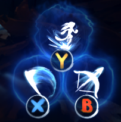
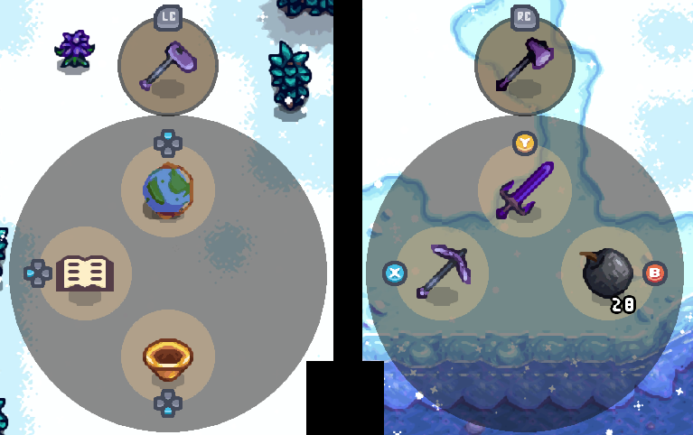
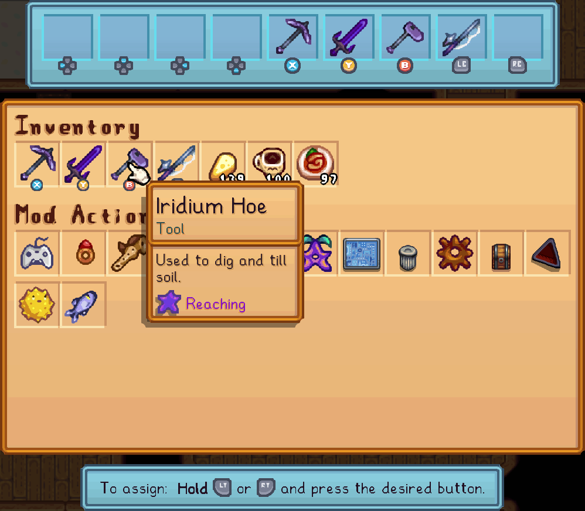

# Instant Actions

Star Control's Instant Actions are also called _Remapping_, as the feature allows you to choose almost any button on the gamepad and assign it to any action you like.

In comparison to external tools like Steam Input or [rewasd](https://www.rewasd.com/), Star Control's instant actions:

- Don't require any separate apps, or a particular edition of the game;
- Can be reassigned while in-game, using an in-game UI;
- Are assigned to specific _Items_ or _Actions_, similar to [quick actions](controller-hud.md#quick-actions), which is more flexible than mapping to a specific key or a different button;
- Will actually **use** the item in that slot when pressed, as in performing axe chops, sword slashes, and so on, which is normally only possible with :prompts-x:{.medium}.

You've probably seen these in many other games:

| Game | |
| --- | --- |
| Legend of Zelda: Ocarina of Time |  |
| Ori and the Will of the Wisps |  |
| Dead Cells |  |

It's not much of a stretch to say that almost _every_ modern game and many not-so-modern games have these "slot-based" control schemes. Stardew Valley's gamepad controls are similar to the first _Harvest Moon_ released in 1996.

Star Control brings the "modern" control style to you in Stardew, using a similar design as the one used for quick actions:

## Setup

Instant actions can be set up using Star Control's instant actions menu (default: :prompts-left-stick:{.medium}).

Follow the instructions on screen to bind, change or unbind (remove) items from slots. You can always remove an item, but can only assign items that are currently in your inventory or in your Mod Menu.

This UI is _not_ part of the [configuration menu](configuration.md), and its data is not saved in the `config.json` file. It uses its own separate UI and data because it is designed to be brought up and changed very often, many times during a normal game day or game session, as opposed to configuration which is complex and should be changed infrequently.

## Limitations

Due to the way the game works, there are some differences between how Instant Actions can be set up, compared to Quick Actions.

- Assigning the :prompts-a:{.medium} button is not allowed; too many different functions of the game rely on it, including machines, gifting and so on.
- To make up for this, :prompts-left-button:{.medium} and :prompts-right-button:{.medium} **are** allowed, even though they are not permitted in quick actions. If assigned here, they will replace the default behavior of these buttons which cycles through backpack pages.
- :prompts-left-trigger:{.medium} and :prompts-right-trigger:{.medium} are also not allowed, due to the potential for conflicts as these are the default inputs used to open the [controller overlay](controller-hud.md) and pie menus.
- Because they are specifically designed as "instant", i.e. intended for fast-paced and/or immersive play without flow interruptions, they do not have settings for delays, [secondary actions](controller-hud.md#activation), confirmation before using, etc. They always perform a specific action per item (often the same as the primary action, but different for tools, weapons, etc.) and never use a delay period or wait for confirmation.

In every way possible, these slots are designed to work identically to other games with reassignable slots—just press the assigned button to use the item in the way that most people would intuitively expect it to be used.